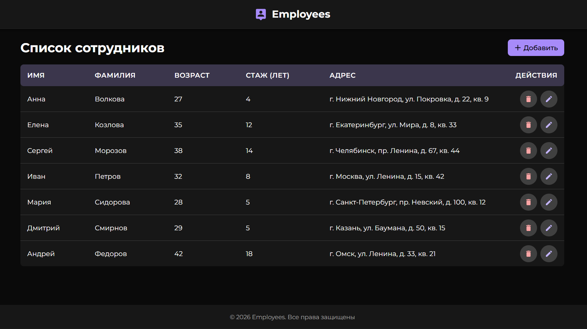

<h1 align="center">Система управления сотрудниками</h1>

<div align="center" id="top">
  
</div>
&#xa0;

Веб-приложение для управления списком сотрудников с полным функционалом CRUD (создание, чтение, обновление, удаление). Реализовано с использованием Vue 3 и архитектурного паттерна MVC.

## 📋 Описание

Приложение позволяет:

- Просматривать список сотрудников в виде таблицы
- Добавлять новых сотрудников через модальное окно
- Редактировать данные существующих сотрудников
- Удалять сотрудников с подтверждением
- Валидировать введенные данные

**Параметры сотрудника:**

- Имя
- Фамилия
- Стаж работы (лет)
- Возраст
- Адрес

## 🏗️ Архитектура

Проект реализован с использованием **паттерна MVC (Model-View-Controller)** и **модульного подхода** к организации кода.

### Структура проекта

```
src/
├── types/           # TypeScript типы и интерфейсы
│   └── employee.ts
├── models/          # Модели (бизнес-логика, валидация)
│   └── EmployeeModel.ts
├── services/        # Сервисы (работа с API)
│   └── EmployeeService.ts
├── stores/          # Pinia stores (состояние приложения)
│   ├── employees.ts # Состояние сотрудников
│   └── ui.ts        # UI состояние (модалки)
├── composables/     # Composables (Controllers)
│   └── useEmployeeForm.ts
├── components/       # Vue компоненты (View)
│   ├── employees/   # Компоненты для работы с сотрудниками
│   ├── UI/          # Переиспользуемые UI компоненты
│   └── core/        # Основные компоненты (Header, Footer)
├── views/           # Страницы приложения
│   └── HomePage.vue
├── layouts/         # Макеты страниц
│   └── MainLayout.vue
└── router/          # Маршрутизация
    └── index.ts
```

### Разделение ответственности (MVC)

#### **Model (Модель)**

- `EmployeeModel.ts` - бизнес-логика, валидация, преобразование данных
- `stores/employees.ts` - состояние данных сотрудников
- `types/employee.ts` - типы данных

#### **View (Представление)**

- `components/` - UI компоненты
- `views/` - страницы приложения
- `stores/ui.ts` - состояние UI (модалки, формы)

#### **Controller (Контроллер)**

- `composables/useEmployeeForm.ts` - координация между Model и View
- `services/EmployeeService.ts` - работа с API

## 🚀 Установка и запуск

### Требования

- **Node.js**: версия `^20.19.0` или `>=22.12.0`
- **npm**: версия 9.x или выше

### Установка зависимостей

```bash
npm install
```

### Запуск в режиме разработки

```bash
npm run dev
```

Приложение будет доступно по адресу: `http://localhost:5173`

## 🛠️ Технологический стек

- **Vue 3** (Composition API) - основной фреймворк
- **TypeScript** - типизация
- **Pinia** - управление состоянием
- **Vue Router** - маршрутизация
- **Axios** - HTTP запросы
- **Vite** - сборщик и dev-сервер
- **SCSS** - стилизация
- **ESLint** - линтинг
- **Prettier** - форматирование

## 📡 API

Приложение использует REST API для работы с данными сотрудников:

**Base URL**: `https://a4d3904e5e5cf144.mokky.dev/employees`

### Эндпоинты

- `GET /employees` - получить список всех сотрудников
- `POST /employees` - создать нового сотрудника
- `PATCH /employees/:id` - обновить данные сотрудника
- `DELETE /employees/:id` - удалить сотрудника

## 🎨 Основные компоненты

### Компоненты сотрудников

- **`EmployeesTable`** - таблица со списком сотрудников
- **`EmployeeFormModal`** - модальное окно для создания/редактирования

### UI компоненты

- **`AppModal`** - базовое модальное окно
- **`AppConfirmModal`** - модальное окно подтверждения
- **`AppInput`** - поле ввода
- **`AppButton`** - кнопка
- **`AppAlert`** - уведомления (успех/ошибка)
- **`AppSpinner`** - индикатор загрузки
- **`AppSkeleton`** - скелетон для загрузки
- **`AppError`** - отображение ошибок

## 📄 Лицензия

Проект создан в рамках тестового задания.
